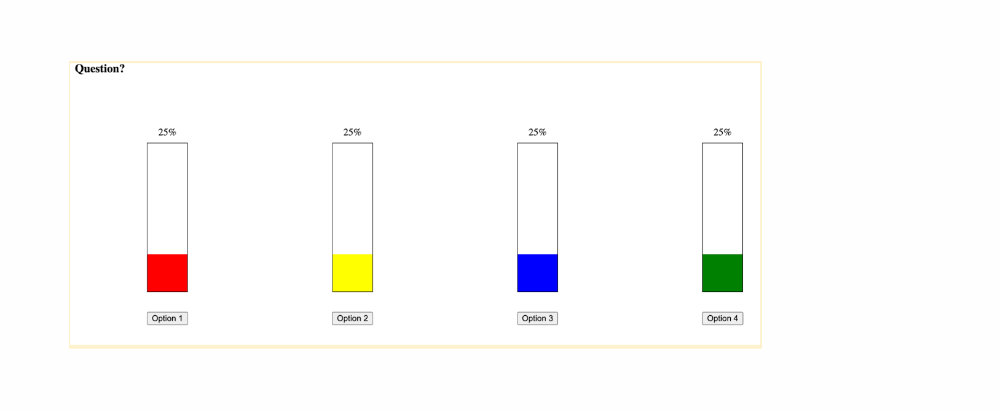

# Voting System - Machine Coding Round

## Problem Statement

Build a **Voting Screen** component that displays poll results with animated progress bars showing vote percentages for each option.

## Requirements

### Functional Requirements

1. Display a list of voting options with their respective vote counts
2. Calculate and display the percentage of votes for each option
3. Render horizontal progress bars for each option
4. Show the vote count and percentage next to each bar
5. Support dynamic vote updates

### UI/UX Requirements

1. Each option should have a **distinct color** for its progress bar
2. Progress bars should be **animated** when displaying or updating values
3. Display total votes count
4. Make the layout **responsive** for different screen sizes
5. Ensure **accessibility** (ARIA labels, keyboard navigation if interactive)

### Technical Requirements

1. Use React with functional components and hooks
2. Component should accept voting data as props
3. Support adding/removing votes dynamically
4. Use CSS/styled-components for styling
5. Handle edge cases (0 votes, single option, etc.)

## Sample Data Structure

```javascript
{
  options: [
    { id: 1, label: "Option A", votes: 150, color: "#FF6B6B" },
    { id: 2, label: "Option B", votes: 200, color: "#4ECDC4" },
    { id: 3, label: "Option C", votes: 100, color: "#FFE66D" },
  ];
}
```


